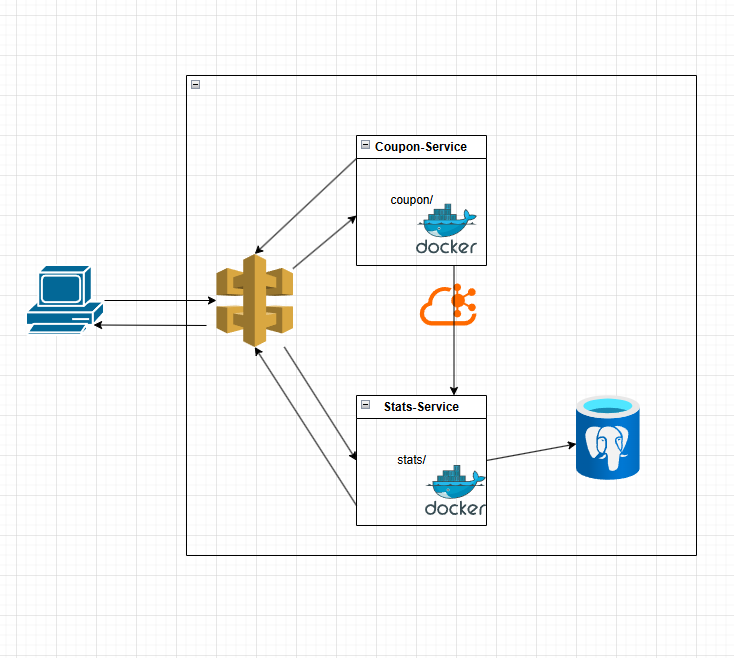

# Challenge: Cupón de compra

Este sistema da como rusltado los productos mas optimos para optimizar el uso de cupones de descuento, asi como informacion de los items mas canjeados.


## Nivel Técnico
Este proyecto implementa una arquitectura de microservicios utilizando Spring Boot y varias herramientas de Spring Cloud para gestionar la configuración, el descubrimiento de servicios y el enrutamiento de API. Los principales componentes del sistema son:

- **Service Registry:** Registro de servicios utilizando Eureka para la detección y registro de microservicios.​

- **Config Server:** Servidor centralizado de configuración que gestiona las propiedades de los microservicios.​

- **API Gateway:** Puerta de enlace que maneja las solicitudes entrantes y las dirige al microservicio correspondiente.​

- **Coupon Service:** Microservicio que gestiona la aplicación de cupones.​

- **Stats Service:** Microservicio que proporciona estadísticas sobre los cupones canjeados.​

### Requisitos


Asegúrese de tener instalados los siguientes componentes:

- Java 17 o superior​
- Docker y Docker Compose​
- Maven 3.6.0 o superior​


### Como Iniciar el Proyecto

- Clonar el Repositorio

```
git clone https://github.com/UsernowII/market-place.git
```

- Todas las dependencias estan configurados en un ambiente en docker

``` bash
docker compose up -d
```

- levantar los servicios
**Nota:** iniciar con el service-registry para no tener errores al levanatr los demas servciios

```
cd service-registry
mvn spring-boot:run

cd config-server
mvn spring-boot:run

etc...
```

Desde el IDE solo debes ir a la clase Main de cada srvicio y ejecutar RUN


## 🚀 Flujo del Sistema

1. 🛒 **Aplicar un cupon:** Recibida una lista de items el sistema buscara los detalles de los items correspondientes haciendo una llamada a otro servicio "externo"
2. 👨‍🍳 **API de Tercero:** (Meli API) el servicio se encarga de la authenticacion mediante la creacion de un token de acceso asi como degestionar el token mediante su fecha de vencimiento para luego consultar el detalle de los items.
2. 👨‍🍳 **Selección de Items:** (Coupon Service) se encarga de maximizar el descuento por cupon respecto al valor de los items y notificar mediante un evento al servicio (Stats Service) sobre los items a canjear y dar una respuesta.
3. 🏬 **Gestión de Estadisticas:** EL servcio de estadisticas (Stats Service)  recibe un evento y almacena en la base de datos los registros canjeados asi como actualizar el historial de items canjeados.


## 🔗 Llamadas HTTP  

## BASE URL
### [http://localhost:9090]

| Servicio          | Método | Endpoint |
|------------------|--------|------------------------------------------------|
| **coupon**       | `POST`  | `/coupon/apply` |
| **stats**        | `GET`  | `/stats/top-redeemed` |


## 🛠️ Tecnologías Utilizadas

- Java 17, SpringBoot, Eureka.
- Docker
- PostgreSQL
- Kafka
- **Microservicios**


